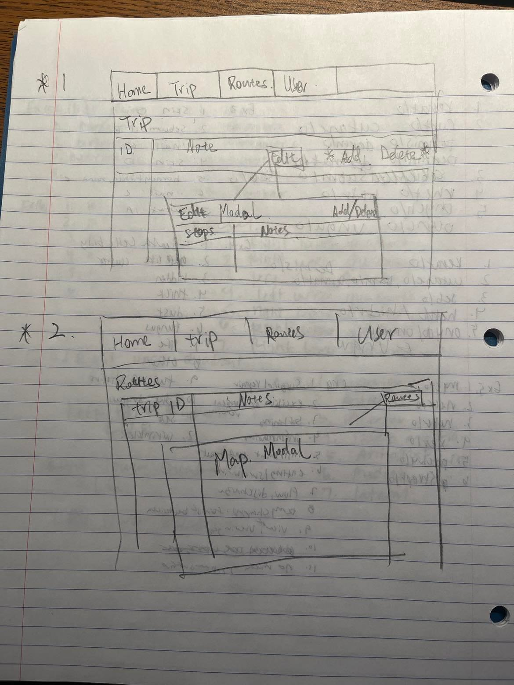
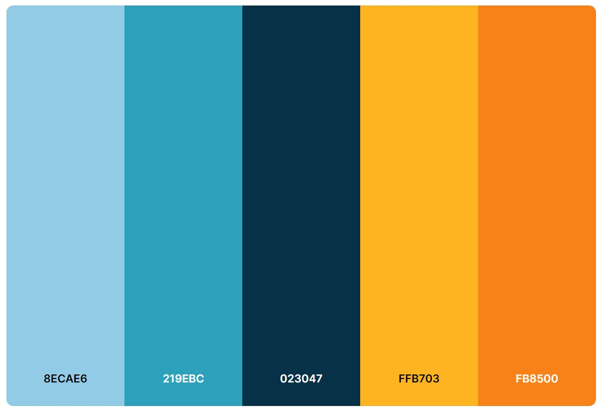
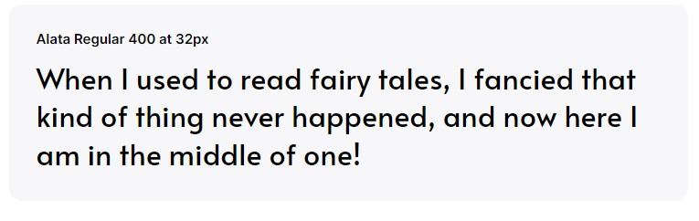

## Added Edit and Delete for Trip stops and Trip
Providing an edit or delete option for users can greatly enhance the user experience, as it allows users to correct mistakes or remove content they no longer want to share.
The edit and delete options labeled clearly and unambiguously, so that users can easily understand what action they will perform when clicking on them.
Using plain language and avoiding jargon can help make the options more accessible to a wider range of users.

## Use Table List Style for Trip, Trip Stops, and Routes
Using a consistent style throughout a website or application is an essential aspect of implementing inclusive design principles.
Consistency creates a sense of predictability and familiarity for users, allowing them to navigate and interact with the interface more easily.

## Color Palette and Font Choices

[Alata](https://fonts.google.com/specimen/Alata)

* Blue: Blue is often associated with travel and the ocean, which can be relevant for a trip planner website. It is also a calming color that can inspire trust and reliability, which may be important for users who are planning a trip.

* Yellow: Yellow is a cheerful and energetic color that can convey optimism and excitement. It can also be associated with sunshine and warmth, which may be appealing for travelers who are planning a vacation.

* Orange: Orange is a bold and vibrant color that can create a sense of enthusiasm and creativity. It can also be associated with adventure and exploration, which can be relevant for a trip planner website.

* Alata font: Alata is a sans-serif font that is clean, modern, and easy to read. It has a slightly condensed and rounded shape, which can make it feel friendly and approachable. It can also be a good choice for mobile devices, where legibility is important.
