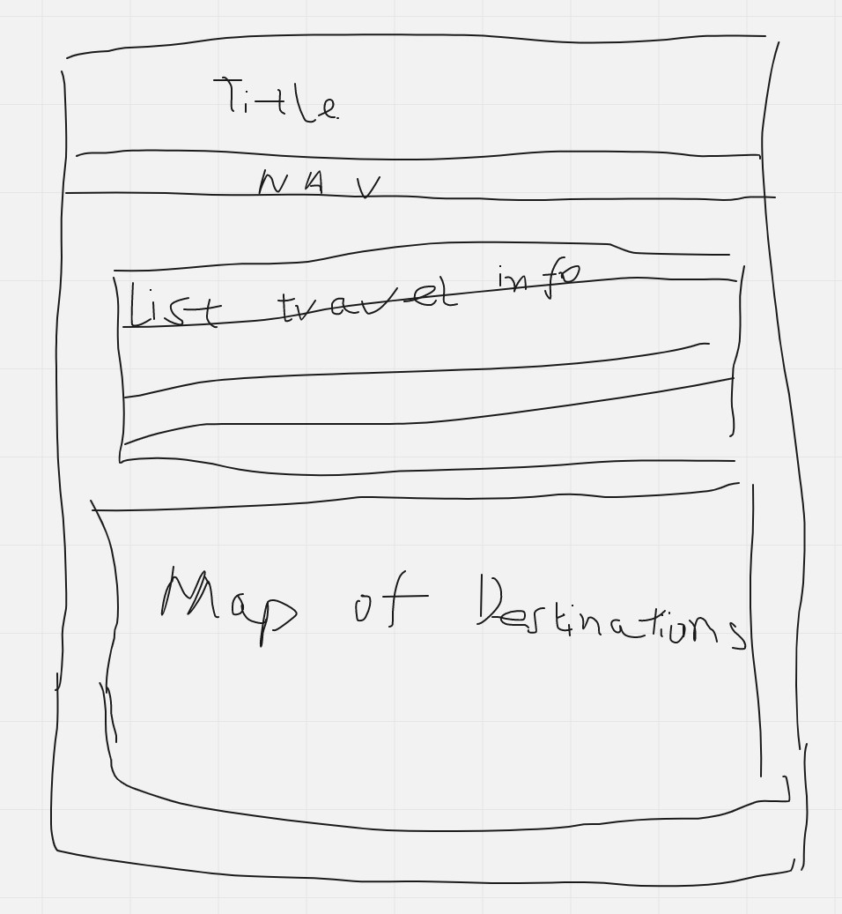
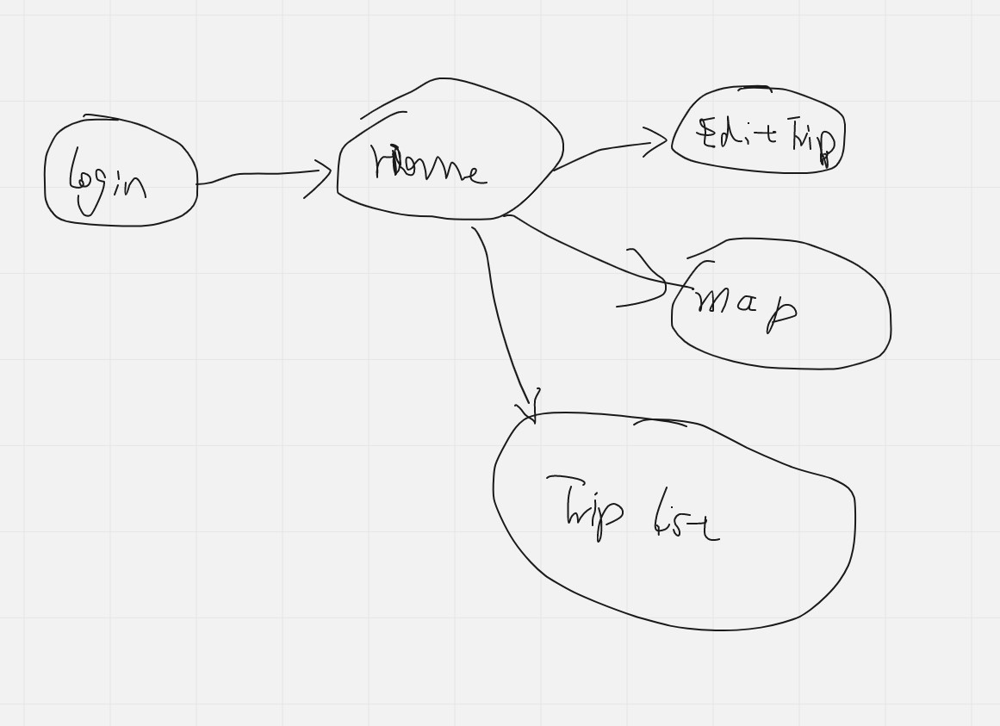

# Trip Planner
Using Google Map API to locate each trip stops showing them on the google map. User will be able to add their own trip stops and trip notes for each stop. A date, time and description can be added to each trip.
User can also plan the trip routes with Google Route API. Trip routes will be displayed on the map, along with trip stop site information.

## Web service
- [Google Map](https://developers.google.com/maps/documentation/javascript) API keys
    - Maps JavaScript API
        - initMap()

- [Google Routes](https://developers.google.com/maps/documentation/routes) OAuth
    - computeRouteMatrix POST /distanceMatrix/v2:computeRouteMatrix

- [Google Places](https://developers.google.com/maps/documentation/places/web-service/search-find-place) API keys
    - Find Place GET
    - Place Details GET

## Database use
I will have a user table, a trip table, and a trip_stop table. User table will record user information. Trip table will record entered trip information and trip stops information. Trip stop table will record detail information about each trip stop.
- user to trip: one to many relation;
- trip to trip_stop: one to many relation;

## Initial designs

